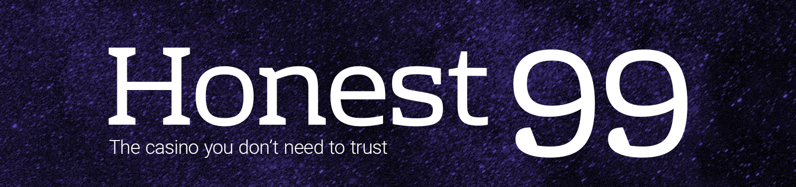

### Development

[figma link](https://www.figma.com/file/YaSFWfbMo4Ey5U1ytbrPZq/Honest-Casino?node-id=0%3A1)

This project consists of the next modules:
1. Solidity contracts inside `contracts` dir
2. Mocha-ts tests under `test` dir
3. Honest Casino frontend in `src`

### Run tests

* make sure you're running `node >=10`
* `yarn install`
* `yarn compile`
* make sure your docker service is running
* `./start-ganache.sh` or `start-ganache.bat`
* `yarn test`

### Contributing

Feel free to open an issue.