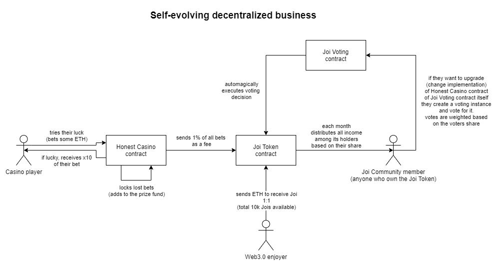

_This repository should always belong to CEO or CTO of Honest Casino, previous owner should archive their copy immediately after an election_

## Honest Casino
The online casino owned by its community

##### The big picture

#### Contracts

##### Joi Token

The hearth of the Honest Casino DAO is `JoiToken` contract which is based on a custom version of `ERC777` - 
`ERC777WithHistory`. This contract provides us with a unique feature - it stores a history of balances of
its accounts. This enables other contracts to verify the possession of some amount of tokens by any account
at any specific moment in the past. 

> this is achieved by saving history snapshots using ERC777 `_beforeTokenTransfer` hook

This feature is fundamental for the entire contract system, because it enables us to implement cheap (in terms
of gas) dividends distribution system and cheap voting system both based on amounts of capital possessed by the 
account. 

`JoiToken` contract uses balance history feature to implement monthly dividend distribution sessions. Shareholders
(Joi Community members) are calling its `requestPayout()` method and receive ETH (if there is at least 1 ETH to distribute)
based on their share at the moment of the beginning of the distribution session.

> For example: 
>
> You had `100 Jois` at the 1st of January and didn't move your Jois after that, this month `500 ETH fees` 
> was collected from the casino and monthly dividend distribution session started today - 2nd of January 
> => your dividends would amount `500 / 10_000 * 100 = 5 ETH`.

You don't need to lock your funds or anything else - the contract knows how much did you have when payout period started.

##### Honest Casino

This contract is very simple. It only has one method to call - `guess()`. It accepts the bet and calculates a random 
number to compare with the callers one. %1 fee of every bet sent to the Joi Token contract.

The only interesting thing about this contract is RNG function. [Here are](rng-security.md) some info about its security.
In short words: it is possible to break it and steal some ETH from the casino, but it is economically ineffective for an attacker.

##### Joi Voting

This is the voting contract that makes our DAO so effective. It also uses balance history feature from `ERC777WithHistory`
the same exact way - when some voting starts, and you vote, it will check your balance at the moment when the voting did start.

There are three types of votings in the current version of this contract:
1. `OTHER` - 'free subject' voting. When you create it, you should just specify some description. Good for some organizational topics.
2. `UPGRADE_CASINO` - this voting is used to upgrade `HonestCasino` contract. When you create it, you should also specify
the address of the new version of this contract. When voting period (30d) end, this address will be automatically assigned
to the `honestCasino` property of the `JoiToken` contract.
3. `UPGRADE_VOTING` - this is the same as the previous one, but provides a way to upgrade the `JoiVoting` contract itself.

As you can see, all responsibility for a current implementation of the casino and voting lies on the voting contract itself.
This means that the DAO itself decides how this Dapp should be implemented.

This contract provides us a way to democratically evolve the whole system when it needs to be evolved. 

### FAQ
Why so little Jois total supply?
> Joi token represents shares. It is not intended to use as a currency on a daily basis. 10k (* 10^18 granularity) 
> is more than enough to reach that goal.

When I call `mint()` method of the `JoiToken` contract, where do my submitted ETH go?
> All the funds that were spent on minting of Joi tokens lock inside `HonestCasino` contact and become a part of the
> prize fund. The whole point of this token is to start the engine of the casino and make it go forever. 

Okay, I now have some Joi tokens in my wallet, when I can start receiving dividends?
> By default `requestPayout()` method of the `JoiToken` is disabled. It automatically enables when two conditions are met:
> 1. All Jois are minted
> 2. There is at least 1 ETH fees collected by the casino

I don't like Honest Casino and the DAO anymore, can I get my ETH back?
> The `mint()` function is one-way, the only thing you can do is to exchange Joi tokens for something else.

### Development

[figma link](https://www.figma.com/file/YaSFWfbMo4Ey5U1ytbrPZq/Honest-Casino?node-id=0%3A1)

This project consists of the next modules:
1. Solidity contracts inside `contracts` dir
2. Mocha-ts tests under `test` dir
3. Honest Casino frontend in `src/casino`
4. Honest Casino DAO frontend in `src/dao`

### Run tests

* make sure you're running `node 10`
* `yarn install`
* `yarn compile`
* make sure your docker service is running
* `./start-ganache.sh` or `start-ganache.bat`
* `yarn test`

### Contributing

If you're interested in making this project (and if you're a part of the DAO, you should be)
consider opening a pull request with the feature you want to be included.

Also feel free to open an issue.